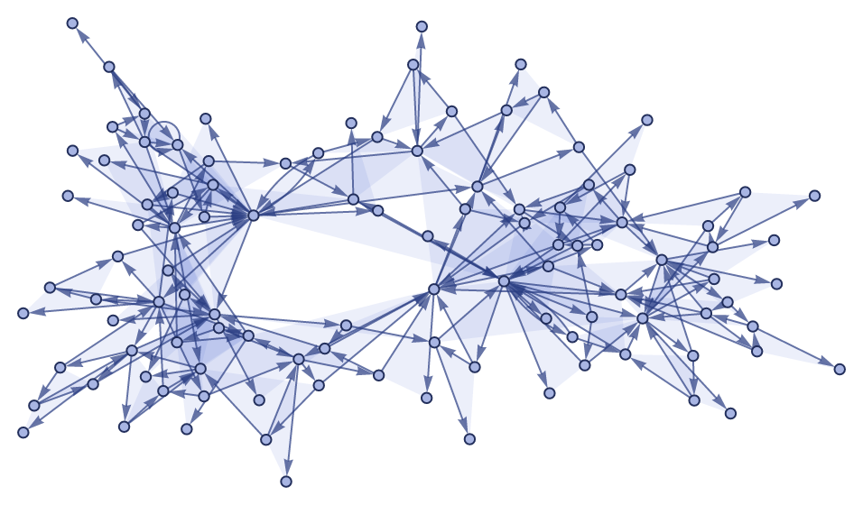
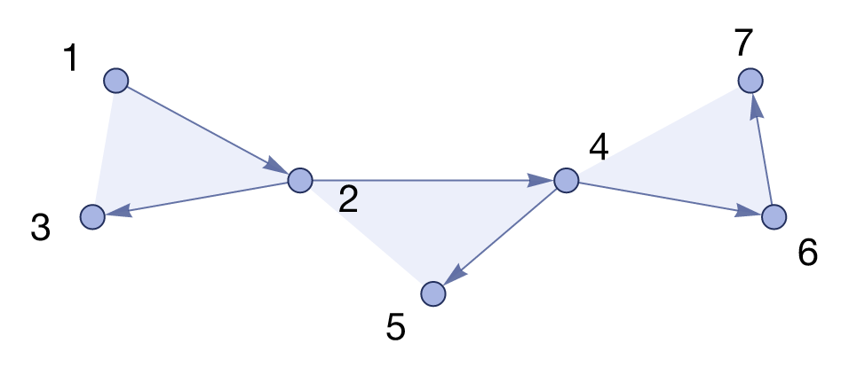
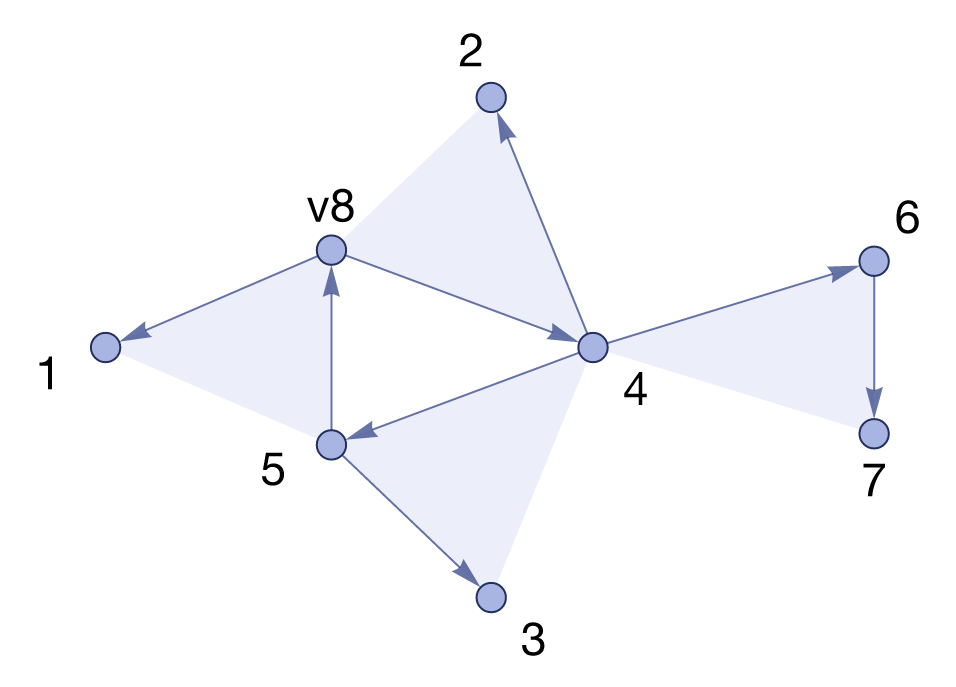
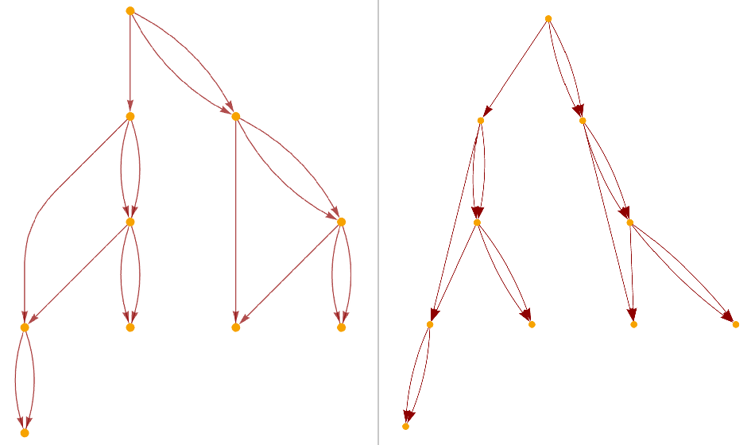

# setreplace-rs

A Rust reimplementation of the core of Wolfram's
[SetReplace](https://github.com/maxitg/SetReplace): **hypergraph substitution
systems** (Wolfram models) — the engine that matches and rewrites ordered
hypergraphs, tracks every token and event, and yields generations, causal
graphs, and the rest — plus a **native visualization engine** that reproduces
`HypergraphPlot`'s look. No Wolfram Language, no graphviz, no runtime
dependencies beyond a pure-Rust rasterizer.



The workspace has two crates:

| crate | what it is | dependencies |
|---|---|---|
| [`setreplace`](src/) | the substitution engine (port of `libSetReplace`, single-history) | none |
| [`setreplace-viz`](viz/) | spring-electrical layout + SVG/PNG rendering in SetReplace's style | `resvg` |

## A Wolfram model in a few lines

```rust
use setreplace::*;
use setreplace_viz::*;

// WolframModel[{{x, y}} -> {{x, y}, {y, z}}, {{1, 1}}, 5]
let rule = Rule::parse("{{x, y}} -> {{x, y}, {y, z}}")?;
let mut system = HypergraphSystem::new(vec![rule], parse_state("{{1, 1}}")?)?;
system.evolve(&StepSpec::generations(5))?;

assert_eq!(system.final_state().len(), 32);          // "FinalState"
assert_eq!(system.events_count(), 31);               // "EventsCount"
assert_eq!(system.generations_count(), 5);           // "TotalGenerationsCount"

let svg = hypergraph_plot_svg(&system.final_state(), &HypergraphPlotOptions::default());
svg_to_png(&svg, std::path::Path::new("state.png"))?;
```

## The canonical evolution

The figure sequence from the SetReplace README, regenerated end-to-end by
this repo (`cargo run --release -p setreplace-viz --example readme_figures`).
The initial hypergraph:

```rust
let init = parse_state("{{1, 2, 3}, {2, 4, 5}, {4, 6, 7}}")?;
let opts = HypergraphPlotOptions {
    labels: Some(readme_style_labels(&init, 8)), // fresh atoms get v-names
    ..Default::default()
};
let svg = hypergraph_plot_svg(&init, &opts);
```



One event of the signature rule — the engine consumes two hyperedges sharing
`v2` and produces three, creating a fresh vertex:

```rust
let rule = Rule::parse(
    "{{v1, v2, v3}, {v2, v4, v5}} -> {{v5, v6, v1}, {v6, v4, v2}, {v4, v5, v3}}",
)?;
let mut system = HypergraphSystem::new(vec![rule], init)?;
system.evolve(&StepSpec::events(1))?;
```



After 10 events:


And after 100 events (103 hyperedges, matching the original README's count):


## Causal graphs

Each event consumes and creates tokens; token flow between events is the
causal graph. The layered rendering pins each event's layer to its
generation, exactly as SetReplace's `"LayeredCausalGraph"` does:

```rust
let svg = layered_causal_graph_svg(&system, &CausalGraphOptions::default());
// or take the raw edges / DOT and do your own thing:
let edges: Vec<(EventId, EventId)> = system.causal_graph_edges(false);
let dot = system.causal_graph_dot(false);
```


## Engine API in one breath

`Rule::parse` accepts the Wolfram-ish forms `{{x, y}} -> {{x, y}, {y, z}}`
and `{{a_, b_}} :> ...` (identifiers are pattern variables, integers are
concrete atoms, output-only variables create fresh atoms). A
`HypergraphSystem` evolves under a `StepSpec` and answers the
evolution-object questions:

```rust
let mut system = HypergraphSystem::with_options(rules, init, EvolutionOptions {
    event_ordering: default_event_ordering(), // {LeastRecentEdge, RuleOrdering, RuleIndex}
    random_seed: 42,                          // seeded tie-breaking
})?;
system.evolve(&StepSpec { max_events: Some(100), ..Default::default() })?;
system.termination_reason();                  // MaxEvents / MaxGenerations / FixedPoint / ...
system.tokens();                              // every hyperedge ever, with creator/destroyer/generation
system.events();                              // every event; [0] is the initial pseudo-event
system.states_by_event();                     // SetReplaceList
system.state_at_generation(2);                // evolution[2]
system.max_complete_generation()?;            // "MaxCompleteGeneration"
```

Rough Wolfram Language ↔ Rust dictionary:

| Wolfram Language | here |
|---|---|
| `SetReplace[set, rules, n]` | `set_replace(&set, &rules, n)` |
| `SetReplaceList[set, rules, n]` | `set_replace_list(&set, &rules, n)` |
| `SetReplaceAll[set, rules, g]` | `set_replace_all(&set, &rules, g)` |
| `SetReplaceFixedPoint[set, rules]` | `set_replace_fixed_point(&set, &rules)` |
| `WolframModel[rules, init, g]` | `system.evolve(&StepSpec::generations(g))` |
| `<\|"MaxEvents" -> n, "MaxVertices" -> v\|>` | `StepSpec { max_events, max_vertices, ... }` |
| `"EventOrderingFunction" -> {...}` | `EvolutionOptions::event_ordering` |
| `"FinalState"` / `"EventsCount"` / `"TerminationReason"` | `final_state()` / `events_count()` / `termination_reason()` |
| `"CausalGraph"` / `"LayeredCausalGraph"` | `causal_graph_edges()` / `layered_causal_graph_svg()` |
| `HypergraphPlot[state]` | `hypergraph_plot_svg(&state, &opts)` |

## Fidelity

Both crates are validated against the original rather than approximated from
memory:

- **Engine**: semantics were ported from a reading of `libSetReplace`
  (matcher, ordering buckets, generation bookkeeping, step limits). The test
  suite includes vectors lifted from SetReplace's own `.wlt` tests (cited by
  file and line) and behaviors verified **live** against SetReplace 0.3.196
  via wolframscript — final states, exact per-event token traces, causal
  edge lists, every named event ordering, termination reasons, and
  fresh-vertex naming all agree. See [tests/wolfram_vectors.rs](tests/wolfram_vectors.rs).
- **Visualization**: colors, vertex size, the arrowhead-length formula, and
  the literal arrowhead polygon are transcribed from SetReplace's style
  sources; layout is the same spring-electrical model (cyclic hyperedge
  springs, mean-edge-length normalization). Side-by-side renders of
  *identical* states, Wolfram on the left, this repo on the right:




## Scope

Included: the single-history hypergraph substitution engine (incremental
matching, all `EventOrderingFunction`s with seeded random tie-breaking,
`MaxEvents`/`MaxGenerations`/`MaxVertices`/`MaxVertexDegree`/`MaxEdges`,
fixed points), full token/event history and its derived properties, causal
graphs, and `HypergraphPlot`-style rendering of states and layered causal
graphs.

Deliberately out (for now): multiway evolution and branchial graphs, event
deduplication, the WL symbolic fallback (non-hypergraph sets, arbitrary
patterns), parallel matching, and the analysis/utility zoo. The full triage,
the exact conventions (0-based ids, event 0 = initial pseudo-event,
fresh-atom naming), and performance notes are in
[docs/engine.md](docs/engine.md); the rendering internals are in
[viz/README.md](viz/README.md).

## Building

```bash
cargo test --workspace                                     # engine + viz tests
cargo run --release -p setreplace-viz --example readme_figures   # regenerate viz/out/*.png
cargo run --release --example bench                        # engine throughput smoke test
```

MIT licensed, like SetReplace itself.
