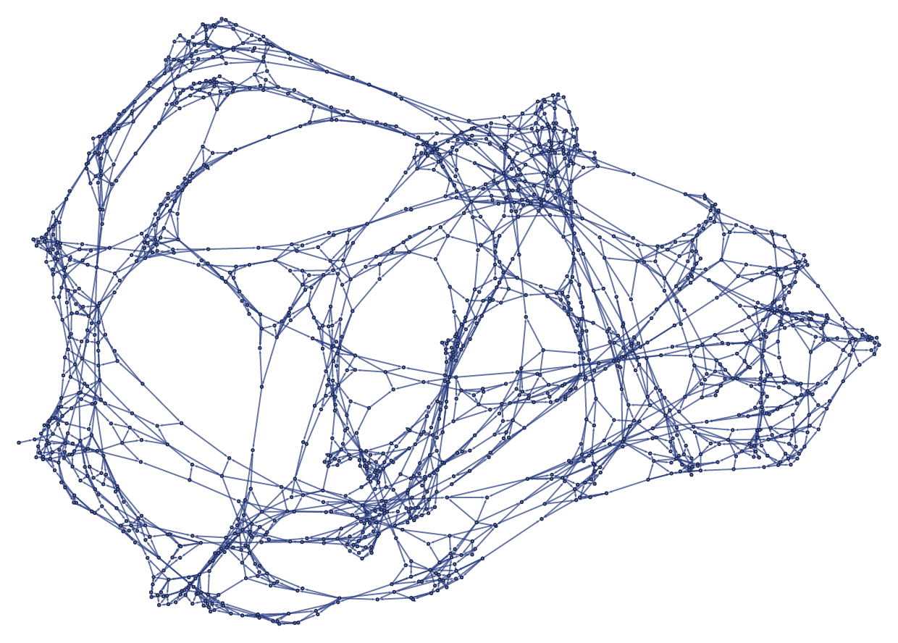
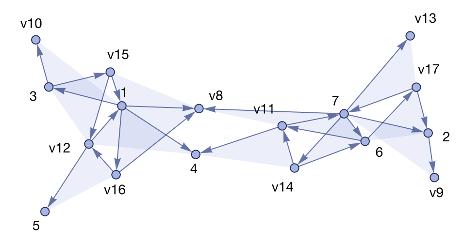
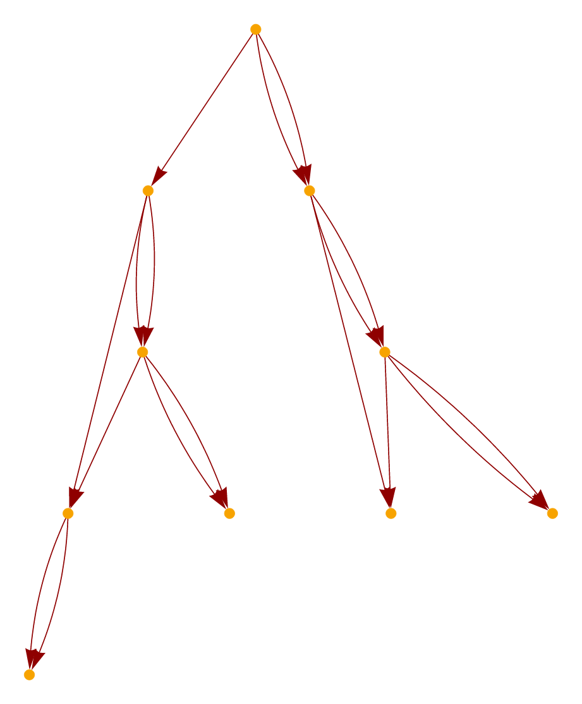
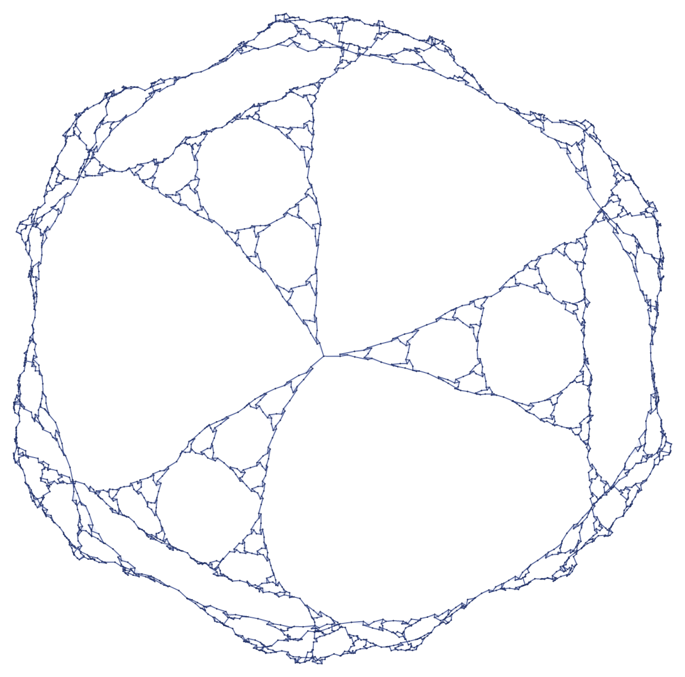
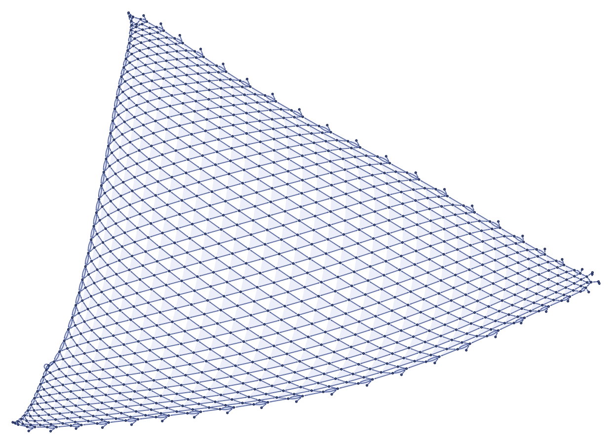
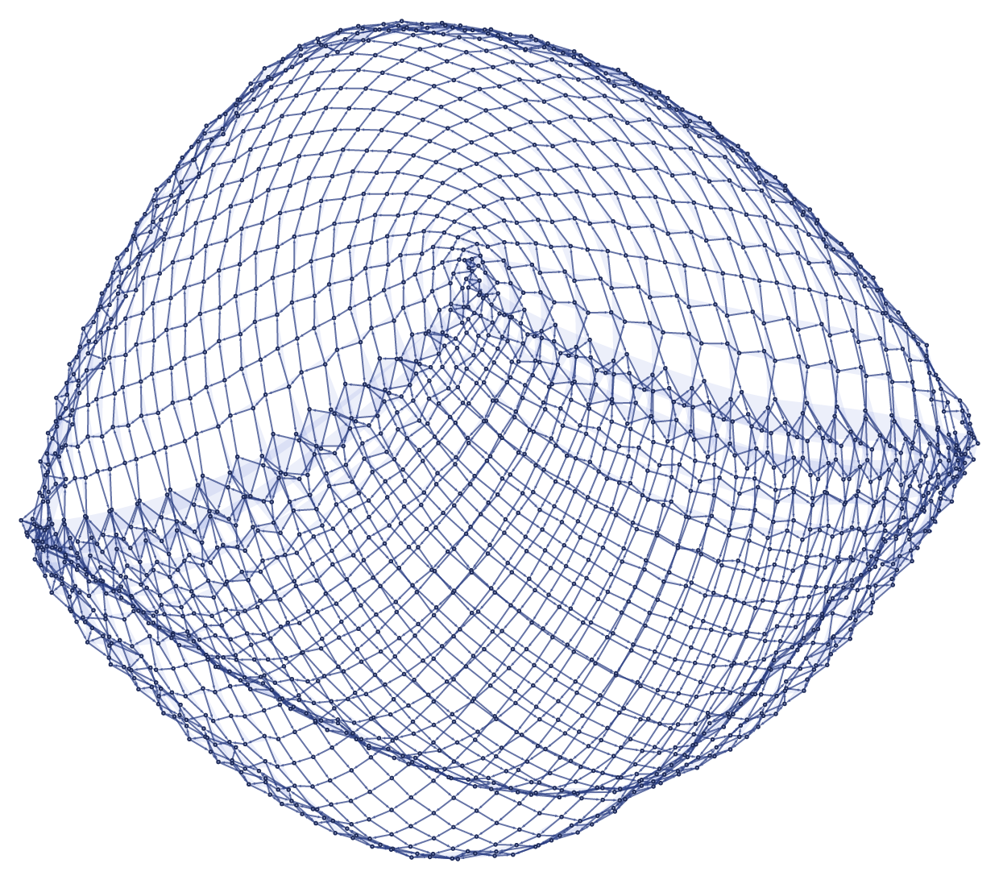
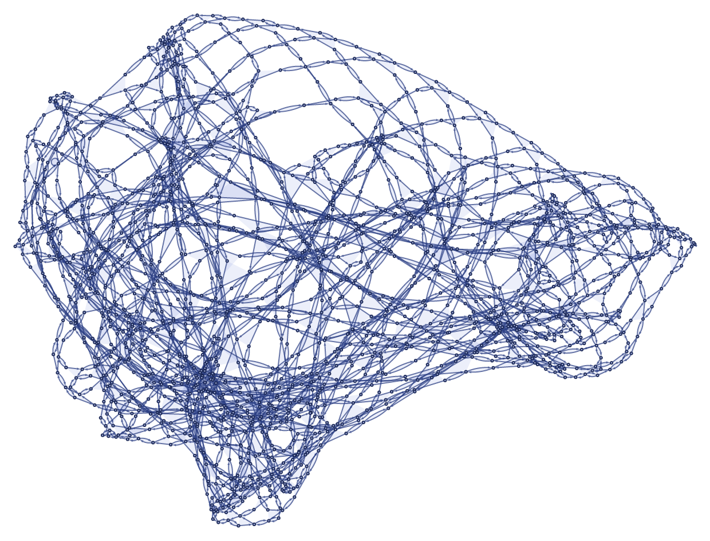
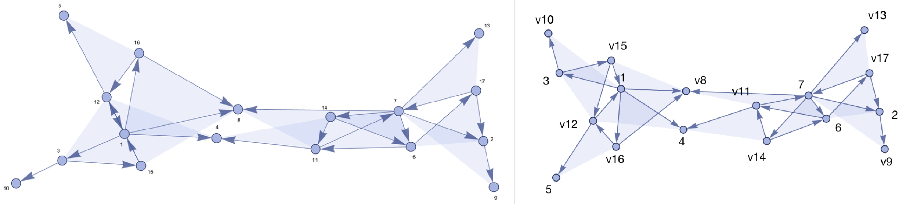

# setreplace

**Wolfram models in Python** — hypergraph substitution systems with the exact
semantics of Wolfram's [SetReplace](https://github.com/maxitg/SetReplace),
plus `HypergraphPlot`-style rendering, powered by a Rust engine. No Wolfram
Language license, no graphviz, no native dependencies to install.

 {{x,z},{x,w},{y,w},{z,w}}">

```python
import setreplace as sr

# The rule from the Wolfram Physics Project announcement
system = sr.evolve("{{x, y}, {x, z}} -> {{x, z}, {x, w}, {y, w}, {z, w}}",
                   [[1, 2], [2, 3], [3, 4], [2, 4]], events=1500)
system.plot()        # ↑ renders inline in Jupyter
```

## Install

```bash
pip install setreplace          # wheels: macOS, Linux, Windows; Python ≥ 3.9
```

(Until the first PyPI release: `pip install maturin && cd python && maturin develop --release`.)

## Five minutes of Wolfram models

A *state* is a list of hyperedges — plain `list[list[int]]`. A *rule*
rewrites sub-hypergraphs, written in the same textual form the SetReplace
docs use:

```python
import setreplace as sr

rule = "{{v1, v2, v3}, {v2, v4, v5}} -> {{v5, v6, v1}, {v6, v4, v2}, {v4, v5, v3}}"
system = sr.evolve(rule, [[1, 2, 3], [2, 4, 5], [4, 6, 7]], events=10)

system                  # <HypergraphSystem: 10 events, 5 generations, 13 edges, MaxEvents>
system.final_state      # [[7, 2, 9], [7, 14, 6], [14, 11, 4], ...]
system.plot(labels=True)
```



Evolution is incremental — keep going, inspect anything, every token and
event carries its full causal history:

```python
system.evolve(max_events=100)            # resume where it stopped
system.termination_reason                # "MaxEvents" | "FixedPoint" | "MaxGenerations" | ...
system.states_by_event()                 # state after every event (SetReplaceList)
system.state_at_generation(2)            # the WL evolution object's [2]
system.tokens()[0]                       # Token(atoms=[1, 2, 3], creator_event=0, ...)
system.causal_graph_edges()              # [(1, 3), (2, 3), ...]
system.causal_graph_plot()               # layered causal graph, inline
```



One-liners mirroring the Wolfram Language functions, and raw layout access
for matplotlib & friends:

```python
sr.set_replace([[1, 2], [2, 3]], "{{a_, b_}, {b_, c_}} :> {{a, c}}")   # [[1, 3]]
sr.set_replace_all(state, rules)             # one generation everywhere
sr.set_replace_fixed_point(state, rules)     # run until nothing matches
pos = sr.layout(system.final_state)          # {atom: (x, y)}, mean edge length 1
system.plot().save("state.png")              # or .svg; rasterized in-process
```

Everything is deterministic: same rules, same seeds → same evolution and the
same figure, every time, on every platform.

## Gallery

Rules from the [Wolfram Physics Project announcement
post](https://writings.stephenwolfram.com/2020/04/finally-we-may-have-a-path-to-the-fundamental-theory-of-physics-and-its-beautiful/),
run long. Each is one `sr.evolve(...)` plus one `.plot()`; regenerate with
`cargo run --release -p setreplace-viz --example showcase`.

`"{{x, y, z}} -> {{x, d, f}, {y, e, d}, {z, f, e}}"` — 7 generations from a
single ternary self-loop: self-similar structure all the way down:



`"{{a, b, b}, {c, a, d}} -> {{b, e, b}, {b, c, e}, {d, e, e}}"` — 1000
events from two self-loops: a regular triangulated net emerges from nothing:



`"{{a, b, c}, {d, b, e}} -> {{f, c, a}, {c, f, d}, {a, b, f}}"` — 2000
events: a curved lens-shaped mesh:



`"{{a, a, b}, {c, d, a}} -> {{d, d, c}, {e, d, e}, {e, b, a}}"` — 2000
events: a densely crumpled ball of space:



Large structured states render in seconds: layout is Yifan Hu's *multilevel*
spring-electrical embedding (the algorithm behind Mathematica's), which is
what lets meshes and fractals unfold instead of freezing into hairballs.

## The API in one breath

| Wolfram Language | Python |
|---|---|
| `WolframModel[rules, init, g]` | `sr.evolve(rules, init, generations=g)` |
| `SetReplace[set, rules, n]` | `sr.set_replace(set, rules, n)` |
| `SetReplaceList` / `SetReplaceAll` / `SetReplaceFixedPoint` | `sr.set_replace_list` / `sr.set_replace_all` / `sr.set_replace_fixed_point` |
| `<\|"MaxEvents" -> n, "MaxVertices" -> v\|>` | `system.evolve(max_events=n, max_vertices=v)` |
| `"EventOrderingFunction" -> {"OldestEdge", ...}` | `event_ordering=["OldestEdge", ...]` |
| `"FinalState"`, `"EventsCount"`, `"TerminationReason"` | `system.final_state`, `.events_count`, `.termination_reason` |
| `"AllEventsList"` / `"AllExpressions"` | `system.events()` / `system.tokens()` |
| `"CausalGraph"` / `"LayeredCausalGraph"` | `system.causal_graph_edges()` / `.causal_graph_plot()` |
| `HypergraphPlot[state, VertexLabels -> Automatic]` | `sr.plot(state, labels=True)` |
| `EnumerateWolframModelRules[{{2, 2}} -> {{3, 2}}]` | `sr.enumerate_rules([(2, 2)], [(3, 2)])` |

Rules can be strings (as above), structured
(`sr.Rule([["x", "y"]], [["x", "y"], ["y", "z"]])` — strings are variables,
ints are concrete vertices), or lists of either. Type stubs ship with the
wheel; the full contract is in [docs/python-api.md](docs/python-api.md).

## How faithful is it?

The engine is a port of SetReplace's C++ core (`libSetReplace`) with the
Wolfram Language layer's semantics — same default event ordering, same
generation bookkeeping, same fresh-vertex naming. It is verified three ways:
unit tests of the matching semantics, test vectors lifted from SetReplace's
own test suite (cited by file and line in
[tests/wolfram_vectors.rs](tests/wolfram_vectors.rs)), and live cross-checks
against SetReplace 0.3.196 under wolframscript — final states, per-event
token traces, causal edge lists, every named event ordering, and termination
reasons all agree exactly. The renderer's palette, vertex size, and arrowhead
geometry are transcribed from SetReplace's style sources. Wolfram's render
left, ours right, on identical data:



Scope today: single-history evolution (the default `WolframModel` behavior),
all event orderings, step limits, full token/event history, causal graphs,
state and causal-graph plots. Not yet: multiway systems and branchial
graphs.

## Using from Rust

The engine (`setreplace`, zero dependencies, ~200k events/s on sparse
models) and renderer (`setreplace-viz`) are ordinary Rust crates — see
[docs/rust.md](docs/rust.md), [docs/engine.md](docs/engine.md), and
[viz/README.md](viz/README.md).

## Acknowledgments

This is an independent reimplementation of the core of
[SetReplace](https://github.com/maxitg/SetReplace) (MIT) by Max Piskunov and
contributors, which defined these semantics and aesthetics; its test suite
and style definitions made exactness possible. Not affiliated with the
SetReplace project, the Wolfram Physics Project, or Wolfram Research.

MIT licensed.
